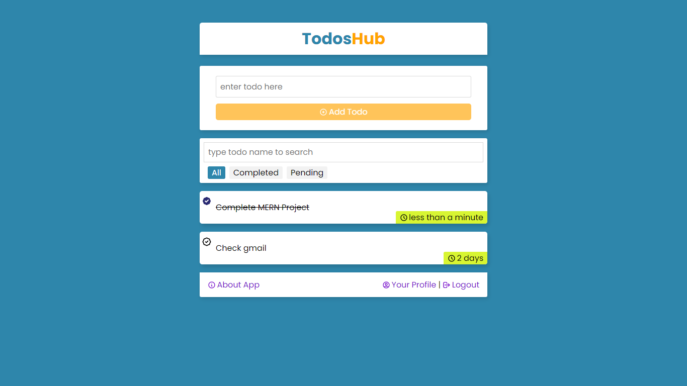
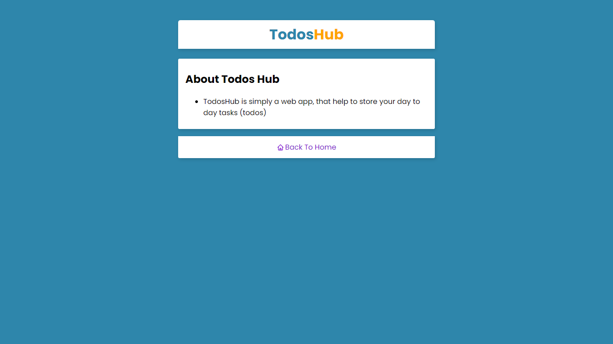
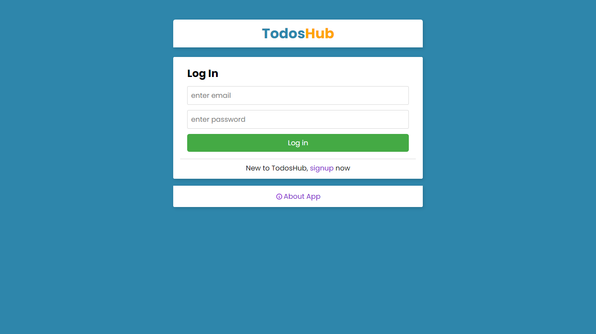
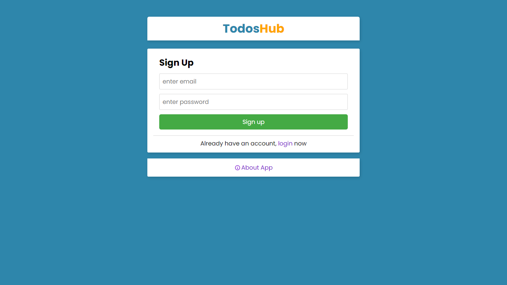

# About Todos Hub

The TodosHub is a todo app build with MERN Stack

## Tech Stack

| Client |  |  |  |  |
| ------ | ---------------------------------------------------------------------------------------------- | ------------------------------------------------------------------------------------------- | --------------------------------------------------------------------------------------------------- | ------------------------------------------------------------------------------------------------------------------------ |

| Server |  |  |  |  |
| ------ | --------------------------------------------------------------------------------------------------- | --------------------------------------------------------------------------------------------------------- | ----------------------------------------------------------------------------------------------------------------------- | ------------------------------------------------------------------------------------------------------ |

## Screenshots

## Concepts & Features

### Concepts

- React Context
- React Router
- React Custom Hooks
- React Portals

### Features

- Toggle todo completion
- Search bar to find the todo that matches the query provided
- Filters based on todo's state (All | Completed | Pending)
